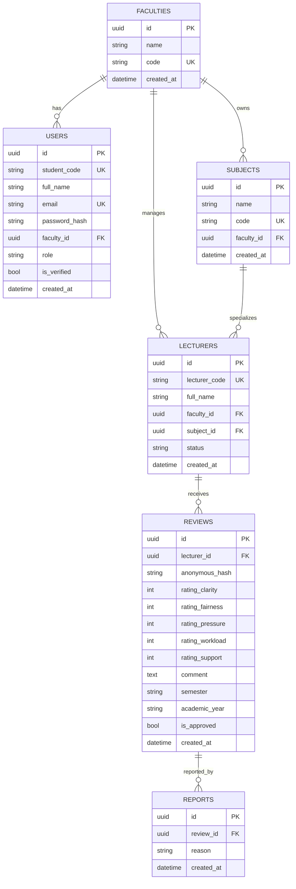

# ERD Diagram

```mermaid
erDiagram
    FACULTIES ||--o{ USERS : has
    FACULTIES ||--o{ SUBJECTS : owns
    FACULTIES ||--o{ LECTURERS : manages
    SUBJECTS ||--o{ LECTURERS : specializes
    LECTURERS ||--o{ REVIEWS : receives
    REVIEWS ||--o{ REPORTS : reported_by

    FACULTIES {
      uuid id PK
      string name
      string code UK
      datetime created_at
    }

    USERS {
      uuid id PK
      string student_code UK
      string full_name
      string email UK
      string password_hash
      uuid faculty_id FK
      string role
      bool is_verified
      datetime created_at
    }

    SUBJECTS {
      uuid id PK
      string name
      string code UK
      uuid faculty_id FK
      datetime created_at
    }

    LECTURERS {
      uuid id PK
      string lecturer_code UK
      string full_name
      uuid faculty_id FK
      uuid subject_id FK
      string status
      datetime created_at
    }

    REVIEWS {
      uuid id PK
      uuid lecturer_id FK
      string anonymous_hash
      int rating_clarity
      int rating_fairness
      int rating_pressure
      int rating_workload
      int rating_support
      text comment
      string semester
      string academic_year
      bool is_approved
      datetime created_at
    }

    REPORTS {
      uuid id PK
      uuid review_id FK
      string reason
      datetime created_at
    }
```
