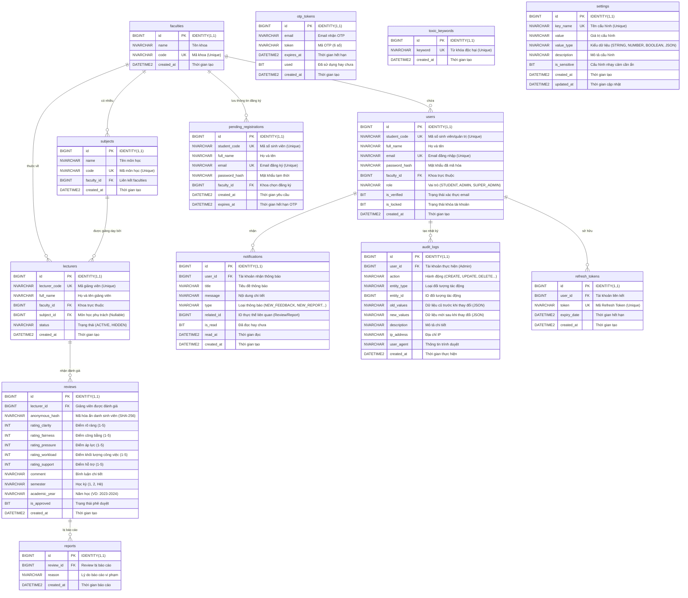

# Sơ đồ Thực thể - Mối quan hệ (Entity-Relationship Diagram - ERD)

Dưới đây là sơ đồ ERD chi tiết cho cơ sở dữ liệu của dự án **CTU Review Platform**, mô tả các bảng, các trường thông tin, kiểu dữ liệu, các khóa (Primary Key - PK, Foreign Key - FK) và mối quan hệ giữa chúng.

## Giải thích chi tiết các mối quan hệ:

1. **Khoa (Faculties) & Môn học (Subjects):** Một khoa có thể quản lý nhiều môn học (`1 - N`).
2. **Khoa (Faculties) & Người dùng (Users)/Giảng viên (Lecturers):** Cả người dùng (sinh viên) và giảng viên đều bắt buộc trực thuộc một khoa cụ thể (`1 - N`).
3. **Môn học (Subjects) & Giảng viên (Lecturers):** Một môn học có thể được phụ trách giảng dạy bởi giảng viên. Cột `subject_id` trong bảng `lecturers` có thể mang giá trị `NULL` nếu giảng viên đó chưa được gán môn học cụ thể.
4. **Giảng viên (Lecturers) & Đánh giá (Reviews):** Một giảng viên có thể nhận được nhiều đánh giá từ các sinh viên khác nhau (`1 - N`).
5. **Đánh giá (Reviews) & Báo cáo vi phạm (Reports):** Một đánh giá có thể bị báo cáo vi phạm nhiều lần bởi các sinh viên khác nhau (`1 - N`).
6. **Người dùng (Users) & Token / Nhật ký / Thông báo:**
   - Mỗi người dùng có thể có nhiều `refresh_tokens` trong quá trình đăng nhập trên nhiều thiết bị.
   - Mỗi người dùng có thể nhận nhiều `notifications` từ hệ thống.
   - Các tài khoản quản trị (Admin/Super Admin) khi thực hiện hành động sẽ tạo ra nhiều `audit_logs` để kiểm toán hệ thống.
