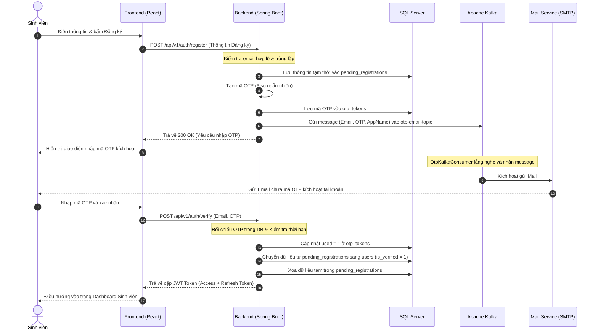
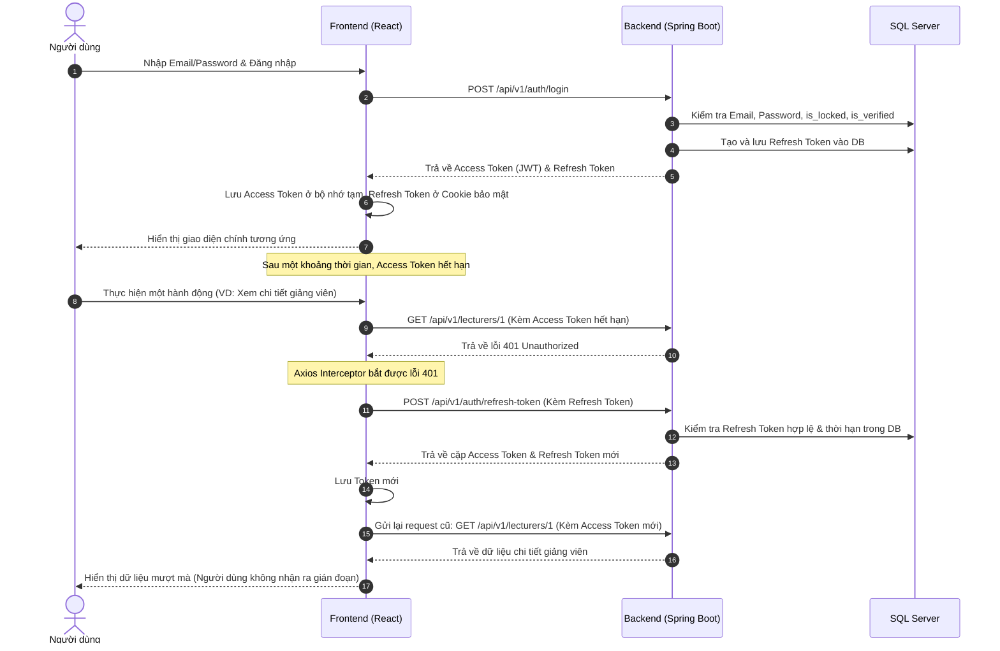

# TÀI LIỆU ĐẶC TẢ HỆ THỐNG (SYSTEM SPECIFICATION)
## DỰ ÁN: CTU REVIEW PLATFORM

Tài liệu này cung cấp mô tả chi tiết, toàn diện về kiến trúc, cơ sở dữ liệu, quy tắc nghiệp vụ, giao diện người dùng và hệ thống API của **CTU Review Platform** — Nền tảng đánh giá và phản hồi chất lượng giảng dạy của giảng viên dành cho sinh viên Trường Đại học Cần Thơ (CTU).

---

## 1. TỔNG QUAN DỰ ÁN (PROJECT OVERVIEW)

### 1.1 Mục tiêu hệ thống
* **Đối với sinh viên:** Tạo môi trường khách quan, an toàn và hoàn toàn ẩn danh để sinh viên có thể chia sẻ phản hồi, đánh giá trung thực về phương pháp giảng dạy, mức độ hỗ trợ, độ công bằng và áp lực của các môn học do giảng viên phụ trách.
* **Đối với giảng viên:** Tiếp nhận những góp ý mang tính xây dựng từ sinh viên nhằm cải tiến nội dung, điều chỉnh phương pháp giảng dạy phù hợp.
* **Đối với nhà quản lý (Admin/Super Admin):** Theo dõi chỉ số hài lòng, thống kê phản hồi tiêu cực/tích cực, phát hiện và xử lý kịp thời các bình luận vi phạm quy chuẩn văn hóa học đường.

### 1.2 Phân quyền người dùng (User Roles)
Hệ thống hỗ trợ 4 nhóm đối tượng chính:
1. **Khách vãng lai (Public User):** Tìm kiếm giảng viên, xem thông tin khoa/môn học và đọc các đánh giá đã được phê duyệt.
2. **Sinh viên CTU (Student):**
   * Đăng ký tài khoản bằng email sinh viên CTU (`@student.ctu.edu.vn`), xác thực qua OTP.
   * Cập nhật hồ sơ cá nhân (Họ tên, Khoa trực thuộc).
   * Viết đánh giá giảng viên dựa trên 5 tiêu chí chuẩn.
   * Báo cáo vi phạm (`Report`) đối với các bình luận không phù hợp của người khác.
   * Xem và quản lý các đánh giá cá nhân đã gửi (`My Reviews`).
3. **Quản trị viên (Admin):**
   * Theo dõi bảng điều khiển thống kê (Dashboard) toàn hệ thống.
   * Phê duyệt hoặc từ chối các đánh giá (`Reviews Moderation`).
   * Xem danh sách báo cáo vi phạm (`Reports`) và xử lý (giữ lại hoặc xóa đánh giá bị báo cáo).
   * Khóa hoặc mở khóa tài khoản sinh viên vi phạm quy chế.
   * Đổi mật khẩu cho người dùng khi có yêu cầu hỗ trợ.
   * Xuất dữ liệu đánh giá ra file CSV.
4. **Quản trị viên cấp cao (Super Admin):**
   * Sở hữu toàn bộ quyền hạn của Admin.
   * Quản lý danh mục Khoa (Faculties) và Môn học (Subjects) (CRUD).
   * Quản lý danh sách Giảng viên (Lecturers) (CRUD).
   * Kích hoạt cơ chế tự động đồng bộ/cào danh sách giảng viên trực tiếp từ website chính thức của CTU (`https://www.ctu.edu.vn/webctu_staff/staff.php`).
   * Quản lý danh sách từ khóa độc hại/từ cấm (Toxic Keywords) để tự động lọc bình luận.
   * Phân quyền tài khoản (Cấp quyền ADMIN cho sinh viên hoặc ngược lại).
   * Xóa vĩnh viễn tài khoản người dùng hoặc các đánh giá vi phạm nghiêm trọng.
   * Xuất danh sách người dùng ra file CSV.

---

## 2. KIẾN TRÚC HỆ THỐNG & CÔNG NGHỆ (ARCHITECTURAL & TECH STACK)

Hệ thống được thiết kế theo mô hình **Client - Server** tách biệt hoàn toàn, đảm bảo tính mô-đun, dễ mở rộng và nâng cấp.

```
+------------------+       HTTPS       +------------------------------------+
|  REACT CLIENT    | <===============> |       SPRING BOOT BACKEND          |
|  (Frontend App)  |   REST / WS API   |       (RESTful Services)           |
+------------------+                   +------------------------------------+
                                                         ||
                                          +--------------++--------------+
                                          |              |              |
                                         \ /            \ /            \ /
                                   +------------+ +------------+ +------------+
                                   | SQL SERVER | |   REDIS    | |   KAFKA    |
                                   | (Database) | |  (Caching) | | (Message)  |
                                   +------------+ +------------+ +------------+
                                                                        ||
                                                                       \ /
                                                                 +------------+
                                                                 | MAIL SMTP  |
                                                                 |  (Gmail)   |
                                                                 +------------+
```

### 2.1 Backend Technology Stack
* **Ngôn ngữ & Framework:** Java 21, Spring Boot 3.x.
* **Kiến trúc mã nguồn:** Layered Architecture (Controller -> Service -> Repository -> Entity/DTO).
* **Bảo mật & Xác thực:** Spring Security, JWT (JSON Web Token) với cơ chế Access Token (hạn 24 giờ) và Refresh Token (hạn 7 ngày) được lưu trữ tại DB.
* **Truy cập cơ sở dữ liệu:** Spring Data JPA / Hibernate, quản lý kết nối hiệu quả.
* **Hệ quản trị cơ sở dữ liệu:** Microsoft SQL Server.
* **Caching & Đếm lượt:** Redis (dùng cho cấu hình, lưu session phụ và xử lý kiểm soát tần suất Rate Limiting).
* **Hàng đợi thông điệp (Message Queue):** Apache Kafka + Zookeeper (phục vụ luồng gửi email OTP bất đồng bộ, tránh nghẽn luồng đăng ký).
* **Thư viện Scraping:** JSoup (dùng để cào thông tin giảng viên từ cổng thông tin CTU).
* **Real-time Notifications:** Spring WebSocket / STOMP.

### 2.2 Frontend Technology Stack
* **Thư viện lõi:** React 19 (Hooks, Context API).
* **Công cụ build:** Vite (tốc độ biên dịch cực nhanh).
* **Quản lý Routing:** React Router v6.
* **Giao tiếp API:** Axios (kèm Interceptors tự động đính kèm Token và xử lý refresh token khi Access Token hết hạn).
* **Styling (CSS):** Tailwind CSS kết hợp thư viện UI Material-UI (MUI) / Shadcn UI cho các thành phần đặc thù.
* **Quản lý State & Call API:** TanStack Query (React Query) hỗ trợ tự động cache dữ liệu và re-fetch thông minh.
* **Hiệu ứng & Icons:** Framer Motion (hiệu ứng chuyển động mượt mà), Lucide React (bộ icon hiện đại).

---

## 3. ĐẶC TẢ CƠ SỞ DỮ LIỆU (DATABASE SPECIFICATION)

Cơ sở dữ liệu của dự án sử dụng hệ quản trị CSDL quan hệ SQL Server. Chi tiết về các bảng và sơ đồ quan hệ ERD có thể được xem tại tài liệu [Sơ đồ ERD](file:///d:/He/Project/docs/ERD.md).

### 3.1 Các bảng danh mục cốt lõi
* **`faculties` (Khoa):** Lưu thông tin các khoa đào tạo tại trường. Cột `code` là duy nhất (Unique) ví dụ: `FIT` (CNTT), `ECO` (Kinh tế).
* **`subjects` (Môn học):** Một khoa quản lý nhiều môn học, mỗi môn học có `code` duy nhất (VD: `CT175` - Cấu trúc dữ liệu). Khóa ngoại `faculty_id` liên kết chặt chẽ với khoa.
* **`lecturers` (Giảng viên):** Chứa thông tin giảng viên gồm mã giảng viên `lecturer_code` (Unique), họ tên `full_name`, trạng thái `status` (`ACTIVE` - đang hoạt động, `HIDDEN` - tạm ẩn khỏi giao diện sinh viên). Liên kết với `faculty_id` và `subject_id` (có thể null nếu chưa gán cụ thể).

### 3.2 Các bảng nghiệp vụ Đánh giá
* **`reviews` (Đánh giá):**
  * Lưu trữ điểm số cho 5 tiêu chí: `rating_clarity` (rõ ràng), `rating_fairness` (công bằng), `rating_pressure` (áp lực), `rating_workload` (khối lượng), `rating_support` (hỗ trợ). Các điểm số này bắt buộc nằm trong khoảng từ `1` đến `5`.
  * Nội dung đánh giá nằm ở cột `comment` (kiểu dữ liệu `NVARCHAR(MAX)` hỗ trợ tiếng Việt có dấu).
  * Ghi nhận `semester` (học kỳ) và `academic_year` (năm học).
  * Ràng buộc duy nhất `uq_review_semester` trên bộ 4 trường: `(anonymous_hash, lecturer_id, semester, academic_year)` để ngăn chặn việc sinh viên spam đánh giá một giảng viên nhiều lần trong cùng một học kỳ.
  * Cột `is_approved` xác định đánh giá đã được hiển thị công khai hay chưa.
* **`reports` (Báo cáo vi phạm):** Khi sinh viên nhận thấy bình luận của người khác mang tính xúc phạm, quảng cáo hoặc toxic, họ có thể gửi báo cáo vi phạm. Mỗi báo cáo liên kết với một `review_id` và ghi nhận lý do `reason`.

### 3.3 Các bảng Quản lý người dùng & Bảo mật
* **`users` (Tài khoản người dùng):** Lưu trữ thông tin tài khoản của Sinh viên, Admin và Super Admin. Cột `role` lưu vai trò dưới dạng chuỗi (`STUDENT`, `ADMIN`, `SUPER_ADMIN`). Mật khẩu được băm an toàn qua thuật toán mã hóa một chiều trước khi lưu vào `password_hash`. Trạng thái kích hoạt được kiểm soát bởi hai cột `is_verified` (đã xác thực email) và `is_locked` (tài khoản có bị khóa hay không).
* **`pending_registrations` (Tài khoản chờ xác thực):** Lưu tạm thời thông tin người dùng đăng ký mới trước khi họ nhập mã OTP chính xác. Dữ liệu trong bảng này sẽ tự động hết hạn sau thời gian `expires_at`.
* **`otp_tokens` (Mã xác thực OTP):** Lưu trữ mã xác thực ngẫu nhiên gồm 6 chữ số gửi qua email của người dùng, thời gian hết hạn `expires_at` và cờ hiệu `used` để chống sử dụng lại mã cũ.
* **`refresh_tokens` (Refresh Token):** Liên kết với người dùng để hỗ trợ luồng cấp lại Access Token tự động khi hết hạn.

### 3.4 Các bảng Tiện ích & Vận hành
* **`toxic_keywords` (Từ khóa cấm):** Danh sách các từ ngữ tục tĩu, nhạy cảm hoặc không văn minh. Hệ thống tự động quét cột `comment` khi sinh viên viết đánh giá mới, nếu chứa bất kỳ từ khóa nào trong bảng này, hệ thống sẽ chặn gửi ngay lập tức.
* **`settings` (Cấu hình hệ thống):** Cho phép Admin/Super Admin cấu hình động các thông số của hệ thống như: Số lượng đánh giá tối đa mỗi ngày (`REVIEW_RATE_LIMIT_PER_DAY`), thời gian sống của OTP (`OTP_TTL_MINUTES`), tên ứng dụng gửi email, v.v., mà không cần khởi động lại Server.
* **`notifications` (Thông báo):** Ghi nhận các thông báo hệ thống hoặc thông báo hành động thời gian thực đến người dùng.
* **`audit_logs` (Nhật ký kiểm toán):** Ghi lại mọi hành động mang tính thay đổi dữ liệu của Admin và Super Admin (đối tượng thay đổi, giá trị cũ, giá trị mới, địa chỉ IP, User Agent).

---

## 4. QUY TẮC NGHIỆP VỤ & BẢO MẬT (BUSINESS RULES & SECURITY)

### 4.1 Quy trình xác thực ẩn danh (Anonymity Flow)
Một trong những tính năng quan trọng nhất của hệ thống là **đảm bảo ẩn danh 100%** danh tính sinh viên khi viết đánh giá giảng viên:
1. Khi sinh viên đăng nhập thành công, hệ thống chỉ sử dụng ID của sinh viên cho các thao tác cá nhân hóa (đổi mật khẩu, xem thông tin khoa).
2. Khi sinh viên viết đánh giá (Review), hệ thống **không bao giờ** lưu `user_id` hay `student_code` vào bảng `reviews`.
3. Thay vào đó, Backend sử dụng dịch vụ băm `HashService` để thực hiện phép băm SHA-256 đối với mã số sinh viên (`studentCode`) kết hợp với một mã khóa bảo mật của hệ thống (`app.review.secret-key` cấu hình ở file properties):
   $$\text{anonymous\_hash} = \text{SHA-256}(\text{studentCode} + \text{secret\_key})$$
4. Giá trị băm `anonymous_hash` (dạng chuỗi Hex 64 ký tự) sẽ là định danh duy nhất của sinh viên đó đối với giảng viên cụ thể nhưng không có cách nào giải mã ngược lại thành mã số sinh viên. Điều này vừa giúp hệ thống kiểm soát được số lượng đánh giá tối đa của mỗi sinh viên, vừa bảo vệ danh tính sinh viên tuyệt đối.

### 4.2 Các giới hạn & Ràng buộc đánh giá (Validation Rules)
* **Giới hạn số lượt đánh giá trong ngày (Daily Rate Limit):** Dựa trên `anonymous_hash`, hệ thống đếm số đánh giá được tạo từ đầu ngày đến cuối ngày (UTC). Nếu vượt quá số cấu hình ở hệ thống (mặc định là `5` đánh giá/ngày), yêu cầu gửi đánh giá sẽ bị từ chối.
* **Giới hạn tần suất trên mỗi giảng viên:**
  * Mỗi sinh viên chỉ được phép đánh giá một giảng viên cụ thể **tối đa 1 lần** trong cùng một học kỳ của một năm học. Ràng buộc này được bảo vệ ở cả mức database thông qua chỉ mục `uq_review_semester`.
  * Mỗi sinh viên chỉ được phép đánh giá một giảng viên cụ thể **tối đa 3 lần** trong suốt quá trình học tập tại trường.
* **Ràng buộc nội dung (Comment Validation):**
  * Bình luận tối thiểu `10` ký tự và tối đa `1000` ký tự.
  * Tự động quét từ cấm thông qua bảng `toxic_keywords` được định nghĩa trong database. Nếu phát hiện từ cấm, hệ thống trả về mã lỗi `400 Bad Request` với thông báo nội dung không phù hợp.

### 4.3 Phê duyệt đánh giá (Moderation Mode)
Hệ thống hỗ trợ cơ chế tự động duyệt ban đầu:
* Khi sinh viên gửi đánh giá, đánh giá được gán mặc định `is_approved = true` và xuất hiện ngay trên giao diện giảng viên.
* Tuy nhiên, hệ thống sẽ gửi một thông điệp thời gian thực (qua WebSocket) đến bảng điều khiển Admin thông báo có đánh giá mới.
* Sinh viên khác có quyền bấm nút "Báo cáo" (`Report`). Khi một đánh giá có báo cáo vi phạm, nó sẽ xuất hiện nổi bật tại trang quản trị Admin.
* Admin có quyền duyệt thủ công: Bấm `Approve` để giữ lại đánh giá đó (và xóa báo cáo) hoặc `Reject` để tạm ẩn đánh giá đó khỏi danh sách hiển thị (`is_approved = false`), hoặc xóa vĩnh viễn đánh giá đó.

### 4.4 Cơ chế đồng bộ/Import giảng viên tự động
Để tránh việc phải thêm tay hàng trăm giảng viên, Super Admin có thể kích hoạt tính năng **Import từ CTU**:
1. Backend sử dụng thư viện `JSoup` để gửi HTTP Request giả lập trình duyệt đến cổng thông tin nhân sự của CTU: `https://www.ctu.edu.vn/webctu_staff/staff.php`.
2. Hệ thống phân tích (parse) cú pháp mã nguồn HTML để trích xuất: Họ tên giảng viên, Khoa giảng dạy/Chuyên ngành.
3. Từ họ tên giảng viên, hệ thống tự động sinh mã giảng viên duy nhất (VD: `CTU` + Họ tên viết liền không dấu, viết hoa) và tự kiểm tra trùng lặp trong DB. Nếu đã tồn tại, hệ thống tự động bỏ qua (Skipped).
4. Hệ thống phân tích chuỗi chuyên ngành để map tự động vào các Khoa trong hệ thống. Nếu không nhận diện được khoa tương ứng, hệ thống sẽ xếp giảng viên đó vào Khoa mặc định do Super Admin chọn trước khi bấm nút Import (Fallback Faculty).

---

## 5. ĐẶC TẢ CHI TIẾT HỆ THỐNG API (API SPECIFICATION)

Tất cả các API của hệ thống đều sử dụng tiền tố `/api/v1` và trao đổi dữ liệu qua định dạng JSON.

### 5.1 Nhóm API Xác thực & Đăng ký (Auth - Public)

| URL Endpoints | Method | Request Body / Params | Mô tả chức năng |
| :--- | :---: | :--- | :--- |
| `/auth/register` | `POST` | `RegisterRequest` | Đăng ký tài khoản sinh viên mới. Yêu cầu nhập email đuôi `@student.ctu.edu.vn`. Trả về thông báo thành công và kích hoạt gửi OTP qua Email. |
| `/auth/verify` | `POST` | `VerifyRequest` | Nhập mã OTP (6 số) để xác nhận kích hoạt tài khoản. Nếu đúng, kích hoạt cờ `is_verified` của user trong DB và trả về Access Token + Refresh Token cùng thông tin Profile. |
| `/auth/login` | `POST` | `LoginRequest` | Đăng nhập tài khoản bằng Email và mật khẩu. Trả về Access Token, Refresh Token, Họ tên, Khoa và Vai trò nếu tài khoản hoạt động. |
| `/auth/forgot-password` | `POST` | `ForgotPasswordRequest` | Yêu cầu lấy lại mật khẩu. Gửi OTP mới đến email người dùng. |
| `/auth/reset-password` | `POST` | `ResetPasswordRequest` | Nhập mã OTP đã nhận cùng mật khẩu mới để tiến hành cập nhật mật khẩu mới. |
| `/auth/refresh-token` | `POST` | `RefreshTokenRequest` | Client gọi khi Access Token hết hạn, gửi Refresh Token để nhận cặp token mới. |

### 5.2 Nhóm API Dữ liệu chung & Tra cứu (Public/Student/Admin)

| URL Endpoints | Method | Request Body / Params | Mô tả chức năng |
| :--- | :--- | :--- | :--- |
| `/metadata/faculties` | `GET` | Không | Lấy danh sách tất cả các khoa sắp xếp theo bảng chữ cái. |
| `/metadata/subjects` | `GET` | `?facultyCode=...` (Optional) | Lấy danh sách môn học, hỗ trợ lọc theo mã khoa. |
| `/lecturers` | `GET` | `?facultyCode=...&subjectCode=...` | Lấy danh sách rút gọn các giảng viên kèm điểm số trung bình và số lượng review, hỗ trợ lọc theo Khoa/Môn học. |
| `/lecturers/page` | `GET` | `?page=0&size=12&facultyCode=...` | Lấy danh sách giảng viên phân trang (Tối đa kích thước trang là 48). |
| `/lecturers/{id}` | `GET` | ID giảng viên trên URL | Lấy chi tiết thông tin giảng viên: Điểm chi tiết 5 tiêu chí, phân bố sao, biểu đồ điểm học kỳ và danh sách review đã duyệt gần nhất. |

### 5.3 Nhóm API dành riêng cho Sinh viên (Token STUDENT)

| URL Endpoints | Method | Request Body / Params | Mô tả chức năng |
| :--- | :--- | :--- | :--- |
| `/students/me` | `GET` | Không | Lấy thông tin hồ sơ của tài khoản đang đăng nhập. |
| `/students/me` | `PUT` | `UpdateProfileRequest` | Cập nhật họ tên hoặc khoa trực thuộc của cá nhân. |
| `/students/me/change-password`| `POST` | `ChangePasswordRequest` | Thay đổi mật khẩu khi đang đăng nhập (yêu cầu mật khẩu cũ). |
| `/reviews` | `POST` | `CreateReviewRequest` | Gửi đánh giá mới cho giảng viên (Backend sẽ mã hóa ẩn danh người gửi). |
| `/reports` | `POST` | `CreateReportRequest` | Gửi báo cáo vi phạm đối với một đánh giá cụ thể. |
| `/reviews/me` | `GET` | Không | Lấy danh sách các đánh giá đã viết của cá nhân sinh viên hiện tại. |

### 5.4 Nhóm API dành cho Quản trị viên (Token ADMIN/SUPER_ADMIN)

*(Lưu ý: Các API đánh dấu `[SA]` yêu cầu quyền `SUPER_ADMIN`, quyền `ADMIN` thông thường sẽ bị hệ thống từ chối truy cập).*

| URL Endpoints | Method | Request Body / Params | Mô tả chức năng |
| :--- | :--- | :--- | :--- |
| `/admin/statistics` | `GET` | Không | Lấy dữ liệu thống kê tổng hợp cho Dashboard quản trị. |
| `/admin/reviews/pending` | `GET` | Không | Danh sách các review đang chờ duyệt hoặc bị báo cáo vi phạm. |
| `/admin/reviews` | `GET` | `?page=...&size=...` | Xem toàn bộ danh sách đánh giá trong hệ thống dưới dạng phân trang. |
| `/admin/reviews/{id}/approve` | `PATCH`| ID review trên URL | Phê duyệt hiển thị công khai cho đánh giá. |
| `/admin/reviews/{id}/reject` | `PATCH`| ID review trên URL | Từ chối hiển thị (ẩn) đánh giá. |
| `/admin/reviews/{id}` | `DELETE`| `[SA]` ID review | Xóa vĩnh viễn đánh giá khỏi hệ thống. |
| `/admin/reviews/bulk-approve` | `POST` | Danh sách ID đánh giá (JSON Array) | Phê duyệt đồng thời nhiều đánh giá. |
| `/admin/reviews/bulk-delete` | `POST` | `[SA]` Danh sách ID đánh giá | Xóa hàng loạt đánh giá khỏi hệ thống. |
| `/admin/reports` | `GET` | `?page=...&size=...` | Xem danh sách các báo cáo vi phạm từ sinh viên. |
| `/admin/reports/{id}` | `DELETE`| ID báo cáo vi phạm | Xóa báo cáo vi phạm (giữ lại review). |
| `/admin/reports/bulk-delete` | `POST` | Danh sách ID báo cáo | Xóa hàng loạt báo cáo vi phạm. |
| `/admin/users` | `GET` | `?page=...&size=...&keyword=...`| Danh sách người dùng, hỗ trợ tìm kiếm theo tên, MSSV, lọc theo vai trò. |
| `/admin/users/{id}/role` | `PATCH`| `[SA]` `UpdateUserRoleRequest` | Thay đổi quyền/vai trò của tài khoản người dùng. |
| `/admin/users/{id}/lock` | `PATCH`| ID user trên URL | Khóa tài khoản người dùng (ngăn không cho đăng nhập). |
| `/admin/users/{id}/unlock` | `PATCH`| ID user trên URL | Mở khóa tài khoản người dùng. |
| `/admin/users/{id}/verified` | `PATCH`| `[SA]` ID user | Xác thực thủ công cho tài khoản sinh viên. |
| `/admin/users/{id}/unverify` | `PATCH`| `[SA]` ID user | Hủy trạng thái xác thực của tài khoản sinh viên. |
| `/admin/users/{id}/reset-password`| `PATCH`| `ResetUserPasswordRequest` | Đặt lại mật khẩu mặc định/mới cho người dùng và trả về chuỗi mật khẩu. |
| `/admin/users/{id}` | `DELETE`| `[SA]` ID user trên URL | Xóa vĩnh viễn tài khoản người dùng. |
| `/admin/export/users` | `GET` | `[SA]` Không | Xuất file CSV danh sách người dùng. |
| `/admin/export/reviews` | `GET` | `?approved=true/false` (Optional) | Xuất file CSV danh sách đánh giá. |
| `/admin/toxic-keywords` | `GET` | Không | Xem toàn bộ danh sách từ khóa cấm trong hệ thống. |
| `/admin/toxic-keywords` | `POST` | `[SA]` `CreateToxicKeywordRequest`| Thêm một từ khóa cấm mới. |
| `/admin/toxic-keywords/{id}` | `PATCH`| `[SA]` `UpdateToxicKeywordRequest`| Sửa đổi từ khóa cấm sẵn có. |
| `/admin/toxic-keywords/{id}` | `DELETE`| `[SA]` ID từ khóa trên URL | Xóa từ khóa cấm ra khỏi hệ thống. |
| `/admin/faculties` | `GET` | `?page=...&size=...` | Lấy danh sách các khoa (phân trang). |
| `/admin/faculties` | `POST` | `[SA]` `CreateFacultyRequest` | Thêm khoa mới vào hệ thống. |
| `/admin/faculties/{id}` | `PATCH`| `[SA]` `UpdateFacultyRequest` | Cập nhật thông tin khoa. |
| `/admin/faculties/{id}` | `DELETE`| `[SA]` ID khoa trên URL | Xóa khoa khỏi hệ thống (lưu ý ràng buộc khóa ngoại). |
| `/admin/subjects` | `GET` | `?page=...&size=...` | Lấy danh sách môn học (phân trang). |
| `/admin/subjects` | `POST` | `[SA]` `CreateSubjectRequest` | Thêm môn học mới vào hệ thống. |
| `/admin/subjects/{id}` | `PATCH`| `[SA]` `UpdateSubjectRequest` | Cập nhật thông tin môn học. |
| `/admin/subjects/{id}` | `DELETE`| `[SA]` ID môn học trên URL | Xóa môn học khỏi hệ thống. |
| `/admin/lecturers` | `GET` | `?page=...&size=...` | Danh sách giảng viên phục vụ mục đích quản trị (phân trang). |
| `/admin/lecturers` | `POST` | `[SA]` `CreateLecturerRequest` | Thêm giảng viên mới vào hệ thống. |
| `/admin/lecturers/{id}` | `PATCH`| `[SA]` `UpdateLecturerRequest` | Cập nhật thông tin giảng viên. |
| `/admin/lecturers/{id}` | `DELETE`| `[SA]` ID giảng viên trên URL | Xóa giảng viên khỏi hệ thống. |
| `/admin/lecturers/{id}/hide` | `PATCH`| ID giảng viên trên URL | Ẩn giảng viên khỏi giao diện sinh viên tìm kiếm. |
| `/admin/lecturers/{id}/unhide` | `PATCH`| `[SA]` ID giảng viên trên URL | Hiện lại giảng viên trên giao diện sinh viên. |
| `/admin/lecturers/import/ctu` | `POST` | `[SA]` `ImportCtuLecturersRequest` | Bắt đầu chạy cào dữ liệu và import danh sách giảng viên từ website CTU. |

---

## 6. ĐẶC TẢ GIAO DIỆN & CHỨC NĂNG FRONTEND (FRONTEND PAGES & FEATURES)

Giao diện người dùng được thiết kế hiện đại, responsive (thích ứng tốt trên cả máy tính, máy tính bảng và điện thoại), sử dụng các hiệu ứng chuyển cảnh mượt mà để tăng trải nghiệm người dùng.

### 6.1 Giao diện dành cho Sinh viên và Khách vãng lai

#### 6.1.1 Trang chủ / Landing Page (`/`)
* **Thành phần:**
  * Header gồm logo CTU Review, menu hướng dẫn, nút Đăng nhập / Đăng ký.
  * Banner chính với khẩu hiệu (Slogan) ấn tượng, truyền cảm hứng đóng góp ý kiến xây dựng.
  * Thanh tìm kiếm giảng viên nổi bật nằm giữa màn hình. Sinh viên có thể nhập tên giảng viên, mã giảng viên hoặc tên môn học để tìm kiếm trực tiếp.
  * Danh mục các Khoa phổ biến dưới dạng các thẻ (Card) trực quan với hiệu ứng hover.
  * Phần giới thiệu ngắn về các cam kết bảo mật danh tính và ẩn danh của hệ thống.

#### 6.1.2 Đăng ký, Xác thực và Đăng nhập
* **Đăng ký (`/register`):** Form đăng ký kiểm tra định dạng email nhập vào, yêu cầu đúng định dạng `@student.ctu.edu.vn` (sinh viên) hoặc `@ctu.edu.vn` (cán bộ/admin). Mật khẩu yêu cầu tối thiểu 6 ký tự và có ô xác nhận mật khẩu. Chọn khoa trực thuộc từ danh sách lấy từ API.
* **Xác thực OTP (`/verify`):** Sau khi gửi form đăng ký, sinh viên được chuyển hướng đến trang nhập mã OTP. Giao diện có đồng hồ đếm ngược 5 phút (thời gian sống của OTP). Nếu hết hạn, hiển thị nút "Gửi lại mã OTP". Nhập đủ 6 số hệ thống sẽ tự động gọi API kích hoạt.
* **Đăng nhập (`/login`):** Nhập email và mật khẩu. Tích chọn "Ghi nhớ đăng nhập" (sử dụng Refresh Token lưu ở Cookie/LocalStorage). Tự động điều hướng dựa trên role của tài khoản sau khi đăng nhập thành công.
* **Quên mật khẩu (`/forgot-password` và `/reset-password`):** Nhập email nhận OTP khôi phục, sau đó nhập OTP cùng mật khẩu mới để thiết lập lại.

#### 6.1.3 Dashboard Sinh viên (`/student`)
* **Thành phần:**
  * Lời chào cá nhân hóa theo họ tên sinh viên.
  * Thống kê tổng số đánh giá cá nhân đã thực hiện.
  * Thẻ hiển thị các đánh giá mới nhất của bản thân kèm trạng thái duyệt của Admin.
  * Danh sách gợi ý giảng viên được đánh giá cao gần đây trong khoa của sinh viên đó.

#### 6.1.4 Danh sách Giảng viên (`/student/lecturers`)
* **Thành phần:**
  * Danh sách giảng viên được hiển thị dưới dạng lưới (Grid Card) phân trang mượt mà.
  * Thanh tìm kiếm thời gian thực.
  * Bộ lọc kép: Lọc theo Khoa (Faculty) và lọc theo Môn học (Subject).
  * Mỗi thẻ giảng viên hiển thị: Họ tên, Khoa trực thuộc, Môn học chính, Điểm đánh giá trung bình tổng hợp (với icon Ngôi sao màu vàng) và số lượng đánh giá đã nhận.

#### 6.1.5 Chi tiết Giảng viên (`/student/lecturers/:id`)
Đây là trang thông tin quan trọng nhất hiển thị báo cáo chi tiết về giảng viên:
* **Khối thông tin chung:** Ảnh đại diện mặc định, Họ tên giảng viên, Khoa, Môn học, số lượt review tổng.
* **Khối điểm số chi tiết:**
  * Điểm trung bình tổng hợp (VD: 4.5/5).
  * Điểm trung bình của 5 tiêu chí: Độ rõ ràng, Độ công bằng, Áp lực môn học, Khối lượng công việc, Mức độ hỗ trợ. Điểm số được hiển thị sinh động bằng thanh tiến trình (Progress Bar) với các màu sắc tương ứng từ đỏ (điểm thấp) sang xanh lá (điểm cao).
* **Biểu đồ phân bố điểm (Rating Distribution):** Hiển thị số lượng và phần trăm các lượt đánh giá từ 1 sao đến 5 sao dưới dạng biểu đồ cột nằm ngang.
* **Biểu đồ so sánh học kỳ (Semester Comparison Chart):** Biểu đồ đường (Line Chart) mô tả sự thay đổi của điểm số trung bình qua các học kỳ khác nhau, giúp sinh viên có cái nhìn trực quan về xu hướng giảng dạy của giảng viên.
* **Danh sách đánh giá gần nhất:**
  * Hiển thị danh sách các bình luận chi tiết đã được duyệt.
  * Mỗi bình luận hiển thị: Thời gian đánh giá (Học kỳ, Năm học), điểm số trung bình của lượt đánh giá đó, nội dung bình luận chi tiết.
  * Nút "Báo cáo vi phạm" (`Report`) được đặt cạnh mỗi bình luận để sinh viên báo cáo nội dung xấu.

#### 6.1.6 Viết Đánh giá mới (`/student/lecturers/:id/review`)
* **Thành phần:**
  * Form chọn Học kỳ và Năm học tương ứng mà sinh viên đã học với giảng viên.
  * Phần đánh giá 5 tiêu chí: Sử dụng giao diện chọn sao (Star Rating) trực quan từ 1 đến 5 sao. Kèm giải thích chi tiết cho từng tiêu chí để sinh viên chấm điểm chính xác (Ví dụ: Áp lực môn học: 1 sao là cực kỳ áp lực, 5 sao là thoải mái dễ chịu).
  * Khung nhập bình luận chi tiết (Comment): Hiển thị số lượng ký tự thời gian thực, cảnh báo nếu dưới 10 ký tự hoặc vượt quá 1000 ký tự. Cảnh báo sinh viên không được sử dụng từ ngữ thô tục.
  * Nút gửi đánh giá: Có hiệu ứng loading khi đang chờ xử lý API.

#### 6.1.7 Quản lý đánh giá của tôi (`/student/reviews`)
* **Thành phần:**
  * Hiển thị toàn bộ các đánh giá mà sinh viên hiện tại đã gửi dưới dạng danh sách dòng thời gian.
  * Cho biết trạng thái đánh giá (Đã duyệt hiển thị, Đang chờ duyệt, Bị từ chối do vi phạm).
  * Cho phép xem chi tiết điểm số đã chấm.

#### 6.1.8 Quản lý thông tin cá nhân (`/student/profile`)
* **Thành phần:**
  * Cho phép xem Mã số sinh viên, Email đăng ký (không cho sửa).
  * Cho phép cập nhật Họ và tên hiển thị.
  * Cho phép chọn lại Khoa trực thuộc.
  * Khu vực đổi mật khẩu: Nhập mật khẩu hiện tại, mật khẩu mới và xác nhận mật khẩu mới.

---

### 6.2 Giao diện dành cho Quản trị viên (Admin/Super Admin Area)

Giao diện quản trị sử dụng thanh điều hướng bên (Sidebar) hiện đại để chuyển đổi giữa các module quản lý.

#### 6.2.1 Dashboard Quản trị (`/admin`)
* **Thành phần:**
  * Các thẻ thống kê tổng quan (Widget): Tổng số sinh viên, tổng số giảng viên, tổng số môn học, tổng số đánh giá đã duyệt, tổng số đánh giá chờ duyệt, tổng số báo cáo vi phạm chưa xử lý.
  * Biểu đồ đường (Line Chart) biểu diễn số lượng đánh giá mới theo từng tháng.
  * Biểu đồ tròn (Pie Chart) biểu diễn tỉ lệ phân bố đánh giá giữa các khoa.
  * Bảng hiển thị danh sách các giảng viên bị báo cáo vi phạm nhiều nhất hoặc giảng viên được đánh giá cao nhất hệ thống.

#### 6.2.2 Quản lý Đánh giá (`/admin/reviews`)
* **Thành phần:**
  * Danh sách toàn bộ các đánh giá trong hệ thống dạng bảng (Table) phân trang.
  * Bộ lọc theo trạng thái duyệt (Đã duyệt, Chưa duyệt).
  * Cột thông tin chi tiết hiển thị: Giảng viên được đánh giá, nội dung bình luận, điểm trung bình chấm, học kỳ/năm học, thời gian tạo.
  * Hộp kiểm (Checkbox) đầu dòng để chọn nhiều đánh giá cùng lúc.
  * Nút tác vụ nhanh trên từng dòng: Duyệt (`Approve`), Từ chối duyệt (`Reject`), Xóa (`Delete` - Super Admin).
  * Thanh công cụ tác vụ hàng loạt (Bulk Actions): Phê duyệt hàng loạt, Xóa hàng loạt (Super Admin).
  * Nút Export CSV để xuất danh sách đánh giá ra file báo cáo Excel.

#### 6.2.3 Quản lý Báo cáo Vi phạm (`/admin/reports`)
* **Thành phần:**
  * Bảng hiển thị các đánh giá bị sinh viên báo cáo.
  * Mỗi dòng hiển thị: Nội dung đánh giá bị báo cáo, lý do báo cáo (do sinh viên nhập), thời gian gửi báo cáo, số lượt báo cáo trùng lặp cho đánh giá này.
  * Tác vụ xử lý:
    * Bấm "Bác bỏ báo cáo" (`Dismiss Report`): Xóa các bản ghi báo cáo vi phạm, giữ nguyên trạng thái hiển thị của đánh giá.
    * Bấm "Xử lý đánh giá" (`Moderate Review`): Ẩn đánh giá bị báo cáo hoặc xóa vĩnh viễn đánh giá đó.
    * Hỗ trợ chọn xóa báo cáo hàng loạt (Bulk Delete Reports).

#### 6.2.4 Quản lý Tài khoản Người dùng (`/admin/users`)
* **Thành phần:**
  * Danh sách toàn bộ tài khoản trong hệ thống kèm Avatar viết tắt, Họ tên, Email, Mã sinh viên, Khoa, Vai trò và Trạng thái.
  * Công cụ tìm kiếm tài khoản theo Họ tên, Mã sinh viên hoặc Email.
  * Bộ lọc theo Vai trò (Student, Admin, Super Admin) và trạng thái kích hoạt (Verified/Unverified).
  * Tác vụ xử lý tài khoản:
    * Khóa tài khoản (`Lock`): Ngăn chặn tạm thời người dùng này đăng nhập hệ thống (nếu họ vi phạm quy chế viết bình luận tục tĩu nhiều lần).
    * Mở khóa tài khoản (`Unlock`).
    * Thay đổi vai trò (`Change Role` - Super Admin): Cấp quyền Admin cho tài khoản hoặc giáng cấp xuống Student.
    * Xác thực tài khoản thủ công (`Verify/Unverify` - Super Admin): Kích hoạt nhanh trạng thái tài khoản không cần qua email OTP.
    * Đặt lại mật khẩu (`Reset Password`): Hệ thống tự động tạo một mật khẩu ngẫu nhiên an toàn hiển thị cho Admin để gửi lại cho người dùng gặp sự cố.
    * Xóa tài khoản (`Delete` - Super Admin): Xóa vĩnh viễn tài khoản khỏi cơ sở dữ liệu.
  * Nút Export Users để xuất danh sách người dùng ra file CSV (Super Admin).

#### 6.2.5 Quản lý Từ khóa Độc hại (`/admin/toxic-keywords`)
* **Thành phần:**
  * Danh sách các từ cấm dạng nhãn (Tags) trực quan.
  * Ô nhập thêm từ khóa mới nhanh. Super Admin nhập từ cấm và ấn Enter để thêm vào DB.
  * Nút xóa từ khóa (icon dấu x trên mỗi nhãn từ khóa) để loại bỏ khỏi danh sách từ cấm.

#### 6.2.6 Quản lý Khoa & Môn học (`/admin/faculties` và `/admin/subjects`)
* **Thành phần:**
  * Bảng quản lý danh mục Khoa: Mã khoa, Tên khoa, ngày tạo, số lượng môn học trực thuộc.
  * Bảng quản lý danh mục Môn học: Mã môn học, Tên môn học, Khoa trực thuộc.
  * Nút thêm mới, chỉnh sửa thông tin trực tiếp trên bảng bằng Dialog/Modal.
  * Tác vụ xóa khoa/môn học (yêu cầu xác nhận và kiểm tra ràng buộc dữ liệu liên quan để tránh mất toàn vẹn dữ liệu).

#### 6.2.7 Quản lý Giảng viên & Import CTU (`/admin/lecturers`)
* **Thành phần:**
  * Danh sách giảng viên đầy đủ thông tin: Mã giảng viên, Họ tên, Khoa, Môn học gán kèm, Trạng thái (Hiện/Ẩn).
  * Cho phép thêm mới giảng viên thủ công.
  * Cho phép chỉnh sửa Khoa hoặc Môn học phụ trách của giảng viên.
  * Cho phép Ẩn giảng viên (`Hide`): Giảng viên này sẽ không hiển thị trên danh sách tìm kiếm của sinh viên nhưng dữ liệu đánh giá lịch sử vẫn được giữ lại đầy đủ. Hiện lại giảng viên (`Unhide`).
  * **Hộp thoại Import Giảng viên từ CTU:**
    * Cho phép Super Admin chọn số lượng trang tối đa cần quét (mặc định là 3 trang đầu, tối đa 30 trang).
    * Cho phép chọn Khoa mặc định (Fallback Faculty) để gán cho các giảng viên không phân tích được khoa trên website CTU.
    * Hiển thị thanh tiến trình và thông tin kết quả sau khi chạy: Số dòng tìm thấy, số giảng viên import mới thành công, số giảng viên bị bỏ qua do trùng lặp, danh sách các lỗi trang (nếu có).

---

## 7. LUỒNG HOẠT ĐỘNG CỦA HỆ THỐNG (DATA FLOW DIAGRAMS)

### 7.1 Luồng Đăng ký & Xác thực OTP qua Kafka



### 7.2 Luồng Đăng nhập & Tự động Làm mới Token (Silent Refresh)



---

## 8. HƯỚNG DẪN CÀI ĐẶT & VẬN HÀNH (DEPLOYMENT & SETUP)

Mọi hướng dẫn khởi chạy hạ tầng (Docker Compose cho SQL Server, Redis, Kafka) cũng như chạy môi trường phát triển cục bộ cho Backend và Frontend đều được trình bày chi tiết tại tài liệu hướng dẫn chung của dự án [README.md](file:///d:/He/Project/README.md).
